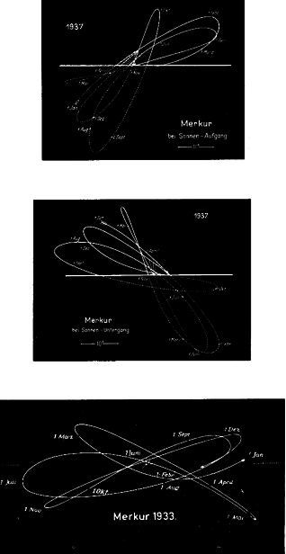

+++
title = "09 Amlodhi the Titan and His Spinning Top"

+++
CHAPTER IX — Amlodhi the Titan and His Spinning Top

Tops of different sorts, and jointed dolls, 

and fair golden 

apples from the clear-voiced Hesperides . . . 

*Orpheus the Thracian*

Though I am not by nature rash or splenetic 

Yet there is in me something dangerous 

Which let thy wisdom fear . . . 

*Hamlet, Act V*

A REASONABLE CASE has been made for the extreme antiquity and continuity of certain traditions concerning the heavens. Even if Amlodhi's Quern, the Grotte and the Sampo as individual myths cannot be traced back beyond the Middle Ages, they are derived in different ways from that great and durable patrimony of astronomical tradition, the Middle East.

Now it is time to locate the origin of the image of the Mill, and further, what its alleged breakup and the coming into being of the Whirlpool can possibly mean.

The starting place is Greece. Cleomedes \(c. A.D. 150\), speaking of the northern latitudes, states \(*1*.7\): "The heavens there turn around in the way a millstone does." Al-Farghani in the East takes up the same idea, and his colleagues will supply the details. They call the star Kochab, beta Ursae Minoris, "mill peg," and the stars of the Little Bear, surrounding the North Pole, and Fas al-rahha \(the hole of the mill peg\) "because they represent, as it were, a hole \(the axle ring\) in which the mill axle turns, since the axle of the equator \(the polar axis\) is to be found in this region, fairly close to the star Al-jadi \(he-goat, Polaris: alpha Ursae Minoris\)." These are the words of the Arab cosmographer al-Kazvini. Ideler comments \[1\]:
>  
> *Koth*, the common name of the Pole, means really the axle of the movable upper millstone which goes through the lower fixed one, what is called the "mill-iron." On this ambiguity is founded the analogy mentioned by Kazvini. The sphere of heaven was imagined as a turning millstone, and the North Pole as the axle bearing in which the mill-iron turns . . . *Fas* is explained by Giggeo . . . as *rima, scissura* etc. . . . The *Fasal-rahha* of our text, which stands also in the Dresden globe beside the North Pole of the Equator, should therefore repre sent the axle bearing.

Farther to the east, in India, the *Bhagavata Purana* tells us how the virtuous prince Dhruva was appointed as Pole star. \[2\]  The particular "virtue" of the prince, which alarmed even the gods, is worth mentioning: he stood on one leg for more than a month, motionless. This is what was announced to him: "The stars, and their figures, and also the planets shall turn around you." Accordingly, Dhruva ascends to the highest pole, "to the exalted seat of Vishnu, round which the starry spheres forever wander, like the upright axle of the corn mill circled without end by the labouring oxen."

The simile of the oxen driven around is not alien to the West. It has remained in our languages thanks to the Latin *Septemtriones*, the seven threshing oxen of Ursa Major: "that we are used to calling the Seven Oxen," according to Cicero's translation of Aratus.

On a more familiar level there is a remark by Trimalchio in Petronius \(*Satyricon* 39\): "Thus the orb of heaven turns around like a millstone, and ever does something bad." It was not a foreign idea to the ancients that the mills of the gods grind slowly, and that the result is usually pain.

Thus the image travels far and wide by many channels, reaches the North by way of Celtic-Scandinavian transmission and appears in Snaebjörn's account of his voyage of discovery in the Arctic. There should be added to those enigmatic lines of his what is known now of the background in Scandinavian lore. The nine grim goddesses who "once ground Amlodhi's meal," working now that "host-cruel skerry quern" beyond the edge of the world, are in their turn only the agents of a shadowy controlling power called Mundilfoeri, literally "the mover of the handle" \(appendix \#15\).

The word *mundil*, says Rydberg, "is never used in the old Norse literature about any other object than the sweep or handle with which the movable millstone is turned," \[3\]  and he is backed by Vigfusson's dictionary which says that "mundil" in "Mundilfoeri" clearly refers to "the veering round or revolution of the heavens."

The case is then established. But there is an ambiguity here which discloses further depths in the idea. "'Moendull' comes from Sanskrit 'Manthati'," says Rydberg, "it means to swing, twist, bore \(from the root *manth*, — whence later Latin *mentula*\), which occurs in several passages in the *Rigveda*. Its direct application always refers to the production of fire by friction." \[4\]

So it is, indeed. But Rydberg, after establishing the etymology, has not followed up the meaning. The locomotive engineers and airplane pilots of today who coined the term "joy stick" might have guessed. For the Sanskrit Pra-mantha is the male fire stick, or churn stick, which serves to make fire. And Pramantha has turned into the Greeks' Prometheus, a personage to whom it will be necessary to come back frequently.

What seems to be deep confusion is in reality only two differing aspects of the same complex idea. The lighting of fire at the pole is part of that idea. But the reader is not the first to be perplexed by an imagery which allows for the presence of planets at the pole, even if it were only for the purpose of kindling the "fire" which was to last for a new age of the world, that world-age which the particular "Pramantha" was destined to rule. The handle, "moendull," and the fire drill are complementary: both have had great developments which superimpose on each other and on a multitude of myths. The obstacles which imagination has to overcome are the associations which are connected spontaneously with "fire," that is, the real burning fire in chimney or hearth, and the kind of "fire" associated with the mentioned "joy stick." Both are irrelevant as far as cosmological terminology is concerned, but they lent the linguistic vehicle which was used to carry the ideas of astronomy and alchemy.

It should be stated right now that "*fire*" is *actually a great circle reaching from the North Pole of the celestial sphere to its South Pole*, whence such strange utterances as *Rigveda* *5*.13.6: "Agni\! How the felly \[5\]  the spokes, thus you surround the gods." \(Agni is the so-called "fire-god," or the personified fire.\) The Atharva Veda says, moreover, that the fire sticks belong to the skambha, \[6\]  the world's axis, the very *skambha* from which the Sampo has been derived \(see above, p. 111\).

The identity of the Mill, in its many versions, with heaven is thus universally understood and accepted. But hitherto nobody seems to have wondered about the second part of the story, which also occurs in the many versions. How and why does it always happen that this Mill, the peg of which is Polaris, had to be wrecked or unhinged? Once the archaic mind had grasped the forever-enduring rotation, what caused it to think that the axle jumps out of the hole? What memory of catastrophic events has created this story of destruction? Why should Vainamoinen \(and he is not the only one\) state explicitly that another Mill has to be constructed \(see p. 110\)? Why had Dhruva to be appointed to play Pole star — and for a given cycle? \[7\]  For the story refers in no way to the creation of the world. One might even ask, as the alternative solution to Rydberg's challenging "limb-grist," whether Bergelmer was not heaved in the same manner "upon the millstone," that is, appointed to play Pole star \(see above, p. 92\).

The simple answer lies in the facts of the case. The Pole star *does* get out of place, and every few thousand years another star has to be chosen which best approximates that position. It is well known that the Great Pyramid, so carefully sighted, is not oriented at our Pole Star but at alpha Draconis, which occupied the position at the pole 5,000 years ago. But, as has been mentioned above \(*Intermezzo*, p. 66\), it is the more difficult for moderns to imagine that in those far-off ages men could keep track of such imperceptible shifting, as many of them are not aware of the mere facts. As Dr. Alexander Pogo, the Palomar astronomer, has written in frustration: "I give up quoting further examples of the obstinate belief of our Egyptologists in the immobility of the heavenly pole." \[8\]  Yet there is quite a collection of myths to show that once upon a time it was realized that the sphere of fixed stars is not meant to circle around the same peg forever and ever. Several myths tell how Polaris is shot down, or removed in some other way. That is reserved for an appendix — \(\#15\).

Most of these myths, however, come under a misleading name. They have been understood to deal with the end of the world. But there are extremely few "eschatological" myths entitled to this label. For example, the Twilight of the Gods is understood as the world's end, yet there is unambiguous testimony to the contrary from the Voluspa and other chapters of the *Edda*. What actually comes to an and is a world, in the sense of a world-age. The catastrophe cleans out the past, which is replaced by "a new heaven and a new earth," and ruled by a "new" Pole star. The biblical flood was also the end of a world, and Noah's adventure is rehearsed in many traditions and many forms all over the planet. The Greeks knew of three successive destructions.

Coherence will be re-established in this welter of traditions if it is realized that what is referred to is that grandest of heavenly phenomena, the Precession of the Equinoxes. The phenomenon has been dealt with in the *Intermezzo* already, but it is essential enough to be taken up more than once. Being so slow, and in a man's age so imperceptible, it has been taken for granted \[9\]  that no one could have detected the Precession prior to Hipparchus' alleged discovery of the phenomenon, in 127 B.C. Hipparchus discovered and proved that the Precession turns around the pole of the ecliptic. \[10\]  It is said that it must have taken an almost modern instrumentation to detect the motion over the brief space of a century, and this is certainly correct. Nobody claims, however, that the discovery, as deduced from observations during one century. And the shift of 1 degree in 72 years, piling up over centuries, will produce appreciable shifts in certain crucial positions, if the observers have enough intentness of mind and know how to keep records. The technique of observation was relatively simple. It was based on the heliacal rising of stars, which remained a fundamental feature in Babylonian astronomy. The telescope of early times, as Sir Norman Lockyer has said, was the line of the horizon. If you came to realize that a certain star, which was wont to rise just before the equinoctial sun, was no longer visible on that day, it was clear that the gears of heaven had shifted. If that star was the last one of a given zodiac figure, it meant that the equinox was moving into a new figure. For is there any doubt — as was already said — that far antiquity was already aware of the shifting of the Pole star. But was it capable of connecting both motions? This is where modern specialists, operating each from his own special angle of vision, have long hesitated.

What is the Precession? Very few have troubled to learn about it, yet to any man of our time, who knows the earth to be spinning around on her axis, the example of a spinning top with its inclined axis slowly shifting around in a circle makes the knowledge intuitive. Anyone who has played with a gyroscope will know all about the Precession. As soon as its axis is deflected from the vertical, the gyroscope will start that slow and obstinate movement around the compass which changes its direction while keeping its inclination constant. The earth, a spinning top with an axis inclined with respect to the sun's pull, behaves like a giant gyroscope, which performs a full revolution in 25,920 years.

Antiquity was not likely to grasp this, since dynamics came into this world only with Galileo. Hipparchus and Ptolemy could not understand the mechanism. They could only describe the motion. We must try to see through their eyes, and think only in terms of kinematics. Over a period of a thousand years ancient observers could discern in the secular shifting of the Great Gyroscope \(it is here in fact that the word "secular" now used in mechanics originates\) a motion through about ten degrees. Once attuned to the secular motion, they were able to detect, in the daily whirring of heaven around the pole, in its yearly turning in the round of the seasons, in the excruciatingly slow motion of the pole over the years, a point which seemed intrinsically more stable than the pole itself. It was the pole of the ecliptic, \[11\]  often referred to as the Open Hole in Heaven because in that region there is no star to mark it. The symmetries of the machine took shape in their minds. And truly it was the time machine, as Plato understands it, the "moving image of eternity." The "mighty marching and the golden burning," cycle upon cycle, even down to shifts barely perceptible over the centuries, were the Generations of Time itself, the cyclical symbol of everlastingness: for, as Aristotle says, what is eternal is circular, and what is circular is eternal.

Yet this uniformly working time machine could be marked with important stations. The gyroscopic tilt causes continual shifting of our celestial equator, which cuts the inclined circle of the ecliptic along a regular succession of points, moving uniformly from east to west. Now the points where the two circles cross are the equinoctial points. Hence the sun, moving on the ecliptic through the year, meets the equator on a point which shifts steadily with the years along the ring of zodiacal signs. This is what is meant by the Precession of the Equinoxes. They "precede" because they go against the order of the signs as the sun establishes this in its yearly march. The vernal equinox — we called it the "fiducial point" previously — which was traditionally the opening of spring and the beginning of the year, will take place in one sign after another. This gives great meaning to the change of signs in which the equinoctial sun happens to rise.

Some additional words of guidance may be called for here, where "signs" are mentioned — those "in" which the sun rises. For roughly two thousand years official terminology has used only zodiacal "signs," each of which occupies 30 degrees of the 360 degrees of the whole circle. These signs have the names of the zodiacal constellations, but constellations and signs are not congruent, the equinoctial sign \(=1°—30°\) being called Aries regardless of the constellation that actually rises before the equinoctial sun. In our time, the constellation rising heliacally on March 21 is Pisces, but the "sign" preserves the name Aries, and will continue to do so when in the future Aquarius rules the vernal equinox. So much for sign versus constellation. \[12\]

As concerns the second ambiguous expression, namely, the sun's rising "in" a constellation \(or a sign\) — this means that the sun rises together with this constellation, making it invisible. There are several reasons for assuming that a constellation \(and a planet which happened to be there\), "in" which the equinoctial sun rose, was termed to be "sacrificed," "bound to the sacrificial post," and the like; and this might explain eventually why Christ, who opened the world-age in which Pisces rose heliacally in the spring, was understood as the sacrificed lamb. When Pisces is the last constellation visible in the east before sunrise, the sun rises together, i.e., "in," the constellation following next, the Ram.

Since the beginning of history, the vernal equinox has moved through Taurus, Aries, and Pisces. This is all that historic experience has shown mankind: a section of about one-quarter of the whole main circle of the machine. That it would come back full circle was at best an inference. It might also, for all men knew, have been part of an oscillation, back and forth, and in fact there were two schools of thought about it, and the oscillation theory seems to have exercised a greater attraction upon the mythographers of old.

For us, the Copernican system has stripped the Precession of its awesomeness, making it a purely earthly affair, the wobbles of an average planet's individual course. But *if*, as it appeared once, it was the mysteriously ordained behavior of the heavenly sphere, or the cosmos as a whole, then who could escape astrological emotion? For the Precession took on an overpowering significance. It became the vast impenetrable pattern of fate itself, with one world-age succeeding another, as the invisible pointer of the equinox slid along the signs, each age bringing with it the rise and downfall of astral configurations and rulerships, with their earthly consequences. Tales had to be told for the people about how successions of ruler ships arose from an origin, and about the actual creation of the world, but for those in the know the origin was only a point in the precessional circle, like the 0 = 24 of our dials. Our clocks today show two pointers only; but the tale-tellers of those bygone days, facing the immense and slow-moving machine of eternity, had to keep track of seven planetary pointers beside the daily revolution of the fixed sphere and of its secular motion in the opposite direction. All these motions meant parts of time and fate.

That things are not as they used to be, that the world is obviously going from bad to worse, seems to have been an established idea through the ages. The unhinging of the Mill is caused by the shifting of the world axis. Motion is the medium by which the wrecking is brought about. The Mill is "transported," be it Grotte or Sampo. The Grotte Song says explicitly that the giantesses first ground forth enemy action whereby the Mill was carried, away and then, shortly afterwards, ground salt and wrecked the machine. It was the end of "Frodhi's peace" — the Golden Age. Even in Snaebjörn's famous lines, the grim goddesses "out at the edge of the world" are those "who ground Amlodhi's meal in ages past." They can hardly be doing it now, because the wrecked millstone is at the bottom of the sea, with its hole become the funnel of the whirlpool. So *that* Mill has been transferred to the waters, and it is now the sea itself which has become "Amlodhi's churn." The heavenly Mill has been readjusted, it goes on working in a new age. It churned once gold, then salt, and today sand and stones. But one cannot, expect the rough Norse mythography to follow it in these legends, which are centered upon storm and wreck, the end of that first age.

Even Hesiod is far from clear about the early struggles and cataclysms; it is enough that in his *Works and Days* he marks a succession of five ages. A more coherent picture can only be built out of the convergence of several traditions, and this shall be the task of further chapters. But right now, there is at least one age designated as the first, when the Mill ground out peace and plenty. It is the Golden Age, in Latin tradition, *Saturnia regna*, the reign of Saturn; in Greek, Kronos. In this dim perplexing figure there is an extraordinary concordance throughout world myths. In India it as Yama; in the Old Persian *Avesta* it was Yima xsaēta, \[13\]  a name which became in New Persian Jamshyd; in Latin Saeturnus, then Saturn's. Saturn or Kronos in many names had been known as the Ruler of the Golden Age, of that time when men knew no war and bloody sacrifices, not the inequality of classes — Lord of Justice and Measures, as Enki since Sumerian days, the Yellow Emperor and legislator in China.

If one wants to find the traces of his sunken Mill in classical mythology, they are not lacking. \[14\]  The oldest is to be found where one would not expect it, in the Great Magical Papyrus of Paris, which is dated about the first half of the fourth century A.D. \[15\]  In its recipes is the "much demanded Oracle of Kronos, the so-called Little Mill":
>  
> Take two measures of sea salt and grind it with a handmill, repeating all the while the prayer that I give you, until the God appears. If you hear while praying the heavy tread of a man and the clanking of irons, this is the god that comes with his chains, carrying a sickle. Do not be afraid, for you are covered by the protection that I give you. Be wrapped in white linen such as the priests of Isis wear \(here follow a number of magic rites\). The prayer to be said while grinding is as follows: I call upon thee, great and holy One, founder of the whole world we live in, who sufferest wrong at the hands of thy own son, thee whom Helios bound with iron chains, so that All should not come to confusion. Man-Woman, father of thunder and lightning, thou who rulest also those below the earth. \(There follow more rites of protection, then the formula of dismissal\): Go, Lord of the World, First Father, return to your own place, so that the All remain well guarded. Be merciful, O Lord \[16\]

Sorcerers and conjurors are the most conservative people on earth. Theirs is not to reason why; they call upon the Power in terms they no longer understand, but they have to give an exact list of the archaic attributes of the fallen god, and even grind out sea salt from the Little Mill, the model of the whirlpool that marked his downfall. What had once been science has become with them pure technology, bent on preservation. A. Barb once coined a simile — he had revealed religion in mind, however, not science; dealing with the relation between magic practices and religion, he pointed to Matt. xxiv.28, Luke xvii.37: "Wheresoever the carcase is, there will the eagles be gathered together," and "Too many critical scholars have been ready to assume that the carcase is therefore a creation of the eagles. But eagles do not create; they disfigure, destroy and dispense what life has left, and we must not mistake the colourful display of decay for the blossoms and fruit of life." \[17\]  Poignant as this image is, namely, in establishing the proper consecutio temporum, it leaves out of consideration the preserving function of magic and superstition: where would the historian of culture be left without those "eagles"?

For all the titles and attributes here listed, there is justification in archaic myth. Right here, only one point is of importance. The Lord of the Mill is declared to be Saturn/Kronos, he whom his son Zeus dethroned by throwing him off his chariot and banished in "chains" to a blissful island, where he dwells in sleep, for being immortal he cannot die, but is thought to live a life-in-death, wrapped in funerary linen, until his time, say some, shall come to awaken again, and he will be reborn to us as a child.

