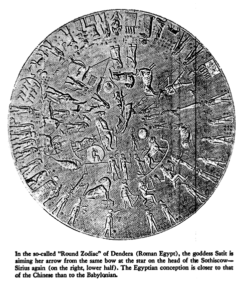

+++
title = "20 The Depths of the Sea"

+++
CHAPTER XX — The Depths of the Sea

Hast thou entered into the springs of the sea? 

Or hast thou walked in the search of the depth? 

*Job* XXXVIII.*16*

IT WILL HELP NOW to take a quick comparative look at the different "dialects" of mythical language as applied to "Phaethon" in Greece and India. The Pythagoreans make Phaethon fall into Eridanus, burning part of its water, and glowing still at the time when the Argonauts passed by. Ovid stated that since that fall the Nile hides its sources. *Rigveda 9*.73.3 says that the Great Varuna has hidden the ocean. The *Mahabharata* tells in its own style why the "heavenly Ganga" had to be brought down. \[1\]  At the end of the Golden Age \(Krita Yuga\) a class of Asura who had fought against the "gods" hid themselves in the ocean where the gods could not reach them, and planned to overthrow the government. So the gods implored Agastya \(Canopus, alpha Carinae = Eridu\) for help. The great Rishi did as he was bidden, drank up the water of the ocean, and thus laid bare the enemies, who were then slain by the gods. But now, there was no ocean anymore\! Implored by the gods to fill the sea again, the Holy One replied: "That water in sooth hath been digested by me. Some other expedient, therefore, must be thought of by you, if ye desire to make endeavour to fill the ocean." It was this sad state of things which made it necessary to bring the Galaxy "down." This is reminiscent of the detail in the Jewish tradition about Eben Shetiyyah, that the waters sank down so deeply that David had to recite the "fifteen songs of ascension" to make them rise again.

Now Agastya, the great Rishi, had a "sordid" origin similar to that of Erichthonios \(Auriga\), who was born of Gaia, "the Earth," from the "seed of Hephaistos who had dropped it while he was looking at Athena. \[2\]  In the case of the Rishi:
>  
> He originated from the seed of Mitra and Varuna, which they dropped into a water-jar on seeing the heavenly Urvashi. From this double parentage he is called Maitrāvaruni, and from his being born from a jar he got the name Khumbasambhava." \[3\]  \(Khumba is the name of Aquarius in India and Indonesia, allegedly late Greek influence\)

On the very same time and occasion there also was "born" as son of Mitra and Varuna — only the seed fell on the ground not in the jar — the Rishi Vasishtha. This is unmistakably zeta Ursae Majoris, and the lining up of Canopus with zeta, more often with Alcor, the tiny star near zeta \(Tom Thumb, in Babylonia the "fox"-star\) has remained a rather constant feature, in Arabic Suhayl and as-Suha. This is the "birth" of the valid representatives of both the poles, the sons of Mitra and Varuna and also of their successors. To follow up the long and laborious way leading from Rigvedic Mitrāvaruna \(dual\) to the latest days of the Roman Empire where we still find a gloss saying "mithra funis, *quo navis media vincitur* "mithra is the rope, by which the middle of the ship is bound," would overstep the frame of this essay by far. Robert Eisler, \[4\]  relying upon his vast material, connected this fetter of "rope," mithra, right away with the "ship's belt" from the tenth book of Plato's *Republic*.

Of the inseparable dual Mitrāvaruna, Varuna is still of greater relevance, particularly because it is he who "surveyed the first creation" \(RV *8*.41.10\), he who hid the Ocean — Ovid had it that the sources of the Nile were hidden — and he who is himself called "the hidden Ocean" \(RV *8*.41.8\). Varuna states about himself: "I fastened the sky to the seat of the Rita" \(RV *4*.42.2\). And at that "seat of Rita" we find *Svarnara*, said to be "the name of the celestial spring . . . which Soma selected as his dwelling. \[5\]  This is no other "thing" than *Hvarna* \(Babylonian *melammu*\) which the "bad uncle" Afrasiyab attempted to steal by diving to the: bottom of Lake Vurukasha, although Hvarna belonged to Kai Khusrau \(see above, pp. 40, 201\). Thus in whichever dialect the phenomenon is spelled out, the fallen ruler of the Golden Age is held to dwell nearest to the celestial South Pole, particularly in Canopus which marks the steering oar of Argo, Canopus at the confluence of the rivers." This is true whether Varuna fastened the sky to the seat of the Rita \(and his own seat\), whether Enki-Ea-Enmesharra, dwelling in Eridu, held all the norms and measures \(Rita, Sumerian *me*: Akkadian: *parsu*\) — Thorkild Jacobsen called him very appropriately the "Lord modus operandi" — or whether Kronos-Saturn kept giving "all the measures of the whole creation" to Zeus while he himself slept in Ogygia-the-primeval.

And there is little doubt, in fact none, that Phaethon \(in the strange transformation scenes of successive ages\) came to be understood as Saturn. There is the testimony of Erastosthenes' Catasterisms, \[6\]  according to which the planet Saturn was Phaethon who fell from the chariot into Eridanus, and Stephanus of Byzantium \[7\]  calls Phaethon a Titan. There is, moreover, the Orphic wording of the case: "After Kronos had emasculated Ouranos, Zeus threw his father \(Kronos\) from the chariot and 'entartarosed' him" right away, if we translate the word literally. \[8\]  Essential key words are easily mistaken for petty details, as in this case the "chariot," from which Kronos/Phaethon was thrown into "Tartaros." The vehicle in question is the two-wheeled race car, Greek *halma*, Latin *currus*, Babylonian *narkabtu*. It is the chariot of Auriga in Babylonia, surviving in the "Sphaera barbarica" of astrologers, \[9\]  whereas in our Sphere the Charioteer is bereft of any vehicle. And, indeed, no other than Erichthonios \(a Greek name for Auriga, besides Hēniochos\) is claimed to have invented the two-wheeled race car drawn by four horses \(Erat. Catast. no. 13, pp. 98-101\) which has to be distinguished carefully from the even more important four-wheeled truck, the Big Dipper, that is, Greek *hamaxa*, Latin *plaustrum*, Sumerian mul.MAR.GID.DA = Charles' Wain.

Slightly perplexing traditions have come down in cuneiform texts, but they clearly allude to the same "event." So, for instance, "The Elamitic chariot, without seat, carries the corpse of Enmesharra. The horses which are harnessed to it are the death-demon of Zu. The king who stands in the chariot is thd hero-king, the Lord Ninurta." Leaving aside the two last sentences which are, in reality, not so pitch dark as they look at first glance, the translator, Erich Ebeling, \[10\]  leaves no doubt that the "Elamitic chariot" is identlcal with the constellation "Chariot of Enmesharra," which the authorities on Babylonian astronomy have identified with beta and zeta Tauri. \[11\]  This Enmesharra now has a "telling" name: En.ME.SARRA is "Lord of all the *me*," that is, he is Lord of "norms and measures," also called "Lord of the World Order", "Lord of the Universe = Ea" and, this is important, \(the weighty one in the underworld" and "the sovereign of the underworld." \[12\]

The "underworld" is misleading, though; the word is: *Arallu*. The experts generally — not the Assyriologists alone — prefer to talk of *names*, in plural, given to the *one* "underworld," instead of trying to find out the precise whereabouts of the several provinces of that huge country, and to establish which name might properly fit every quarter. As if one did not know of the plurality of "hells" and "heavens." Here, however, it is not necessary to bring order into the quarters of the Mesopotamian Hades, and for the time being, it suffices that the Lord of the World Order, Enmesharra, is Enki-Ea, because it is known anyhow that he dwells "at the seat of Rita": Eridu-Canopus. And since "Enmesharra's chariot" is the vehicle of Auriga, beta zeta Tauri, there can be little doubt that the tradition of Phaethon's fall was already a Sumerian myth \(appendix \#22\). And as in Greece, where the drastic version of the Orphics, of Hesiod and others are found side by side with those of Plutarch and Proclus, according to which Kronos gives with paternal grace "all the measures of the whole creation" to his son Zeus, \[13\]  so, too, we have in Mesopotamia cruel-sounding variations besides "reasonable" ones. For example, when Marduk builds his "world" and receives fifty new names, his father Ea gives him his very own name, stating \(EE 7.141f.\): "His name shall be Ea. All my combined rites he shall administer; all my instructions he shall carry out." And as concerns Ea under the name of Enmesharra, Edzard states: "An incantation of Neo-Assyrian times, using an epithet of Enmesharra 'Who transferred scepter and sovereignty to Anu and Enlil' possibly hints to the voluntary abdication of the god." \[14\]

One of the questions begging answers is, *which* measures are meant, and how does Saturn accomplish his assignment "to give them continuously" to Jupiter? And, even if it is accepted that his "seat" is Canopus, how can he possibly give the measures from there? Without pretending to understand the scheme well for the time being, there are some explanations which seem to be the most plausible ones.

Above \(p. 136\), attention was called to the significance of the revolution of that Trigon which is built up by "Great Conjunctions" of Saturn and Jupiter, and was still understood By Kepler \(see figure\). Now, whoever tries to imagine. the degree of difficulty which faced the oldest "mythographers" will realize how welcome it must have been to find periods which fitted into each other at least approximately. This Trigon of Great Conjunctions presented itself as the instrument by which one could "narrow down" the almost imperceptible tempo of the Precession. To move through the whole zodiac, one of the angles of the Trigon need approximately 3 x 794 1/3 = 2,383 years. That comes tolerably near to one double-hour of the greatest "day" of the Precession of 25,900 years \(appendix \# 23\). A new zodiacal sign was termed to "rise" starting from the day of a great conjunction at the place of the "passage." The marginal point of Greek time-reckoning was the date of the first Olympic Games: they had been founded in memory of the wrestling of Kronos and Zeus. Pausanias said. The celestial constellation, however, ruling the different traditional dates of the first Olympic Games does not justify this claim; in other words, it is not known yet which particular great conjunction it was in the memory of which the Games were supposed to have been introduced. Our own era, the Age of Pisces, started with a great conjunction in Pisces, in the year 6 B.C.

By means of this Trigon, Saturn does give *panta ta metra* continuously to his "son" Zeus, and this same Trigon appears to be called "gellius" in the Orphic fragment already quoted \(155 Kern\), where Zeus addresses Kronos wIth the words, "Set in motion our genus, excellent Demon." And Proclus alluded to it in his statement \(*ibid*.\), and Kronos seems to have with him the highest: causes of junctions and separations." And still according to Macrobius he was the "originator" of time \(*Sat. 1*.22.8: "Saturnus ipse qui auctor est temporum."\) \[15\]  So much for Saturn the unalterable planet gliding along his orb. Saturn as the fallen ruler of the Golden Age and retired to Eridu is a much harder proposition. Although there is also evidence to the contrary, there are many indications that the South Pole — Canopus — was taken for static, exempted from the Precession. \[16\]  And this would mean — at least it might mean, because it fits so well into those notions of "time and the rivers" — that expired periods return "home" into timelessness, that they flow into eternity whence they came. Access to the Confluence of the Rivers, Mouth and Source of aeons and eras, the true seat of immortality, has always been denied to any aspect of "time, the moving likeness of eternity." For eternity excludes motion. But from this desired motionless home, source and mouth of times, the world-ruler has to procure the normed measures valid for his age; they are always based on time, as has been said. Again it is the same whether it was Marduk who first "crossed the heavens and surveyed the regions. He squared Apsu's quarter, the abode of Nudimud \(= Ea\). As the lord measured the dimensions of Apsu," and then erected his palace as the "likeness" of Apsu, or whether it was Sun the Chinese Monkey who fetched his irresistible weapon from the "navel of the deep" — an enormous iron pillar by means of which, once upon a time, Yü the Great had plumbed out the utmost depth of the sea. In any case, whether the description is sublime or charmingly nonsensical, it is literally the "fundamental" task of the Ruler to "dive" to the topos where times begin and end, to get hold of a new first day." As the Chinese say, in order to rule over space one has to be master of time.

The reader may suspect by now that Hamlet has been forever forgotten. The way has been long and circuitous, but the connection is still there. Even in so late and damaged a tradition as that of Saxo Grammaticus, every motif once made sense in high and far-off times. If it is difficult to recognize the central significance of the "oar" of Odysseus, \[17\]  how much more difficult is it to spot the "steering oar of Argo" = Canopus-Eridu, in the childish riddle of Amlethus? And yet, the "measuring of the depth of the sea" is there all the time; infant-Kullervo dared to do it with a ladle, coming to the startling result of "three ladles and a little bit more." And there is an even less suitable measure to be had, a veritable stylus. Jacob Grimm gives the story: "The medieval Dutch poem of Brandaen . . . contains a very remarkable feature: Brandaen met on the sea a man of thumb size, floating upon a leaf, holding in his right hand a small bowl, in the left hand a stylus; the stylus he kept dipping into the sea and letting water drip from it into the bowl; when the bowl was full, he emptied it out, and began filling it again. It was imposed on him, he said, to measure the sea until Judgment day." \[18\]  This particular kind of "instrument" seems to reveal the surveyor in charge in this special case. Mercury was the celestial scribe and guardian of the files and records, "and he was the inventor of many arts, such as arithmetic and calculation. and geometry and astronomy and draughts and dice, but his great discovery was the use of letters," as Plato has it \(*Phaedrus* 274\).

It remains to be seen whether or not all the measuring planets can be recognized by their particular methods of doing the measuring. It is known how Saturn does it, and Jupiter. Jupiter "throws," and Saturn "falls." But, as was said before, Saturn giving the measures as resident in Canopus is hard to imagine. Maybe all the available keys to this door have not been tried? Observing so many characters occupied with measuring the depth of the sea, one stumbles over the strange name given to Canopus by the Arabs: they call it the weight," and the Tables of Alphonsus of Castile spell it "Suhel ponderosus," the heavy-weighing Canopus. \[19\]  This "weight" is the plumb at the end of the plumb line, by means of which this depth was measured. So far so good. But where does Saturn come in? He can be understood as the "living" plumb line. \[20\]  This would be hard to believe if the story of this surveying were not told by the plumb line itself, Phaethon. Only when he told it, he had another name, as belongs to the manners and customs of celestial characters: Hephaistos. \[21\]

In the first book of the *Iliad* \(*1*.5 89ff.\), Hephaistos tries to appease his mother Hera who is very angry with her husband Zeus, and says to her:
>  
> "It is hard to fight against the Olympian. There was a time once before now I was minded to help you and he caught me by the foot and threw me from the magic threshold, and all day long I dropped helpless, and about sunset I landed in Lemnos, and there was not much life left in me."

Hephaistos mentions the event once more, when Thetis asks him to forge the shield for her son Achilles \(*18*.39Sff.\):
>  
> 

> "She saved me when I suffered much at the time of my great fall through the will of my own brazen-faced mother, \[22\]  who wanted to hide me for being lame. Then my soul would have taken much suffering had not Eurynome and Thetis caught me and held me. Eurynome, daughter of Ocean, whose stream bends back in a circle. With them I worked nine years as a smith."

Indentured as a smith again, like Kullervo.  

**The Chinese picture illustrates the surveying of the universe. ****Sir Aurel Stein, Innermost Asia, Clarendon Press, Oxford, 1928**

Krates of Pergamon \[23\]  explains this feature in the sense that Zeus aspired to the measurement of the whole world \(*anametrēsin tou pantos*\). He succeeded in determining the measures of the cosmos by "two torches moving with the same speed": Hephaistos and the Sun. Zeus hurled the former down from the threshold to earth at the same moment when the latter was starting from point east on his way to the west. Both reached their goal at the same time: the Sun was setting when Hephaistos struck Lemnos.

Krates felt convinced that Homer spoke of a sphere, and since he himself was most interested in the coordinate system of the sphere he did not find it strange to interpret in his own sense the shield of Agamemnon \(*Iliad* *11*.32f.\) and of Achilles \(*18*.468ff.\). \[24\]  He also conceived Odysseus' sailing from Circe's island to Hades as a voyage from the Tropic of Capricorn to the South Pole. The idea is not so strange as it might seem. Zeus, establishing the equinoctial colure by hurling down the fictitious "Phaethon," introduced a new *skambha* — one remembers Plato about this: "It has the air of a fable . . ." \[25\]  But there is also Cornford's idea of the vision of Er, \[26\]  according to which Plato's "souls actually see in their vision not the universe itself, but a model, a primitive orrery in a form roughly resembling a spindle . . ."

It is sad to observe, and certainly odd, how little scholars trust their own eyes and words — as in the case of Jane Harrison who remarked on the Titans: "They are constantly driven down below the earth to nethermost Tartaros and always reemerging. The very violence and persistence with which they are sent below shows that they belong up above. They rebound like divine india-rubber balls." \[27\]  It is rather evident that these divine india-rubber balls were not really sent below: what was overthrown were the expired ages together with the names of their respective rulers.

But now the galactical stage is empty and it is almost time to watch the working of the next *skambha* grinding out the "destiny" for the first postdiluvian generation. But before facing the hero of the oldest, the most difficult, and by all means the oddest of epics, there is an interval. We seize the occasion to insert a chapter on methods, presented by means of a well-known episode.

