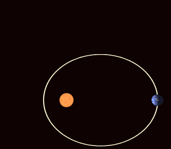

## Intro
- Like other planets, angular speed of earth around sun is uneven - slower at aphelion, faster at perihelion. If solstice positions occur between aphelion and perihelion, one half will be shorter than another. The maximum gap between half years (eg solstice to solstice) is 187:178 (as in -3980BCE).
- Solstice positions relative to aphelion and perihelion keeps shifting due to Apsidal precession. See [chart](https://docs.google.com/spreadsheets/d/e/2PACX-1vT_bsnxAJV4r18m6LP6rx8_JY7szc13CYB5Z-_9r39akNtERroUcfpI-kTSAbtLKrCQ3ePi3aaj1ILc/pubhtml) here.

{caption="Apsidal precession" class="thumbnail"}

## Records
- Shatapatha brAhmaNa altar construction seems to approximately represent this with the 14:15 brick layout. See S kAk [here](../../history/solar_orbit_brAhmaNas_subhASh_kAk/). 
  - while 18/19 is a superior approximation, 14/15 is still a decent approximation of  179/186 with a few "standard" bricks. Assuming a looser approximation/ representation seemd more "charitable" for our ancestors than assuming that they imprecisely measured half-yr.
  - This  might have been reflected in Angkor Wat construction.
