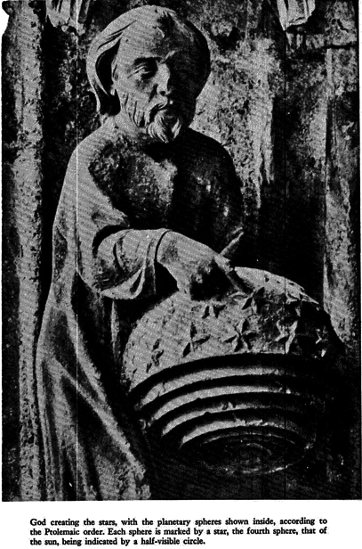
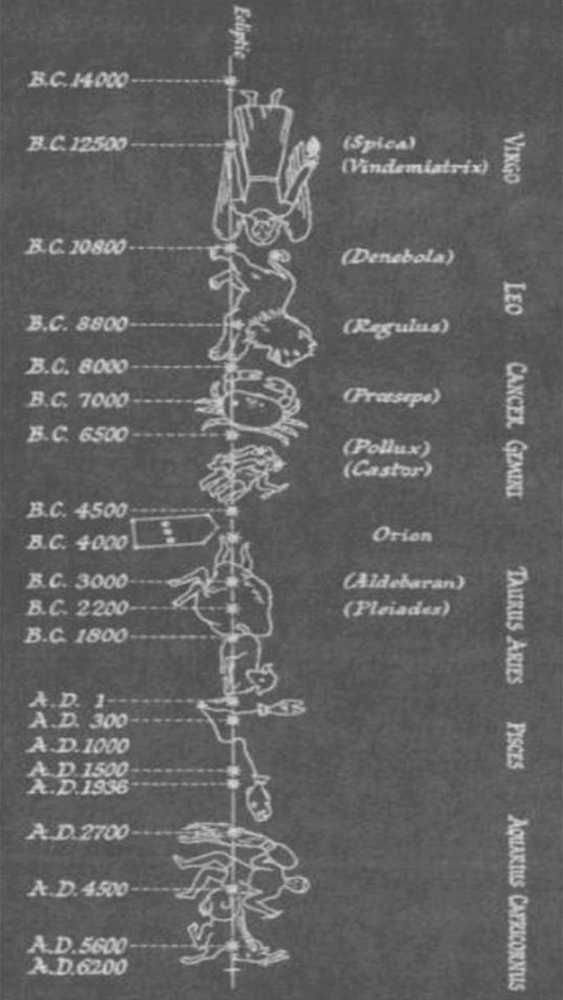

+++
title = "+Hamlets mill"
+++

Hamlet's Mill

**An Essay Investigating the Origins of Human Knowledge and ****Its Transmission Through Myth**

by **Giorgio de Santillana** and **Hertha von Dechend**

**1977**

{caption="" class="thumbnail"}

{caption="" class="thumbnail"}

{caption="" class="thumbnail"}
